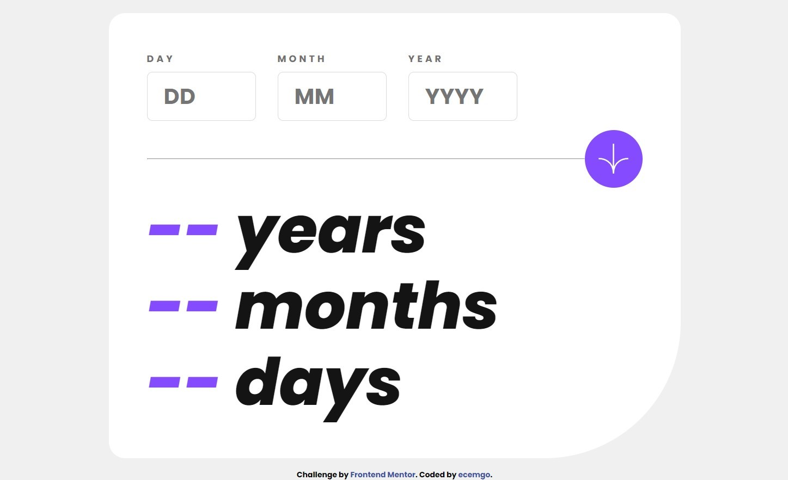

#  Frontend Mentor - Age Calculator App Solution

This is a solution to the [Age calculator app challenge on Frontend Mentor](https://www.frontendmentor.io/challenges/age-calculator-app-dF9DFFpj-Q). Frontend Mentor challenges help you improve your coding skills by building realistic projects.

## Table of contents

- [Overview](#overview)
  - [The challenge](#the-challenge)
  - [Screenshot](#screenshot)
  - [Links](#links)
- [My process](#my-process)
  - [Built with](#built-with)
  - [Useful resources](#useful-resources)
- [Author](#author)

## Overview

### The challenge

Users should be able to:

- View an age in years, months, and days after submitting a valid date through the form
- Receive validation errors if:
  - Any field is empty when the form is submitted
  - The day number is not between 1-31
  - The month number is not between 1-12
  - The year is in the future
  - The date is invalid e.g. 31/04/1991 (there are 30 days in April)
- View the optimal layout for the interface depending on their device's screen size
- See hover and focus states for all interactive elements on the page
- **Bonus**: See the age numbers animate to their final number when the form is submitted

### Screenshot

### Links

- [Solution URL](https://your-solution-url.com)
- [Live Site URL](https://ecemgo-age-calculator.netlify.app/)

## My process

### Built with

- Semantic HTML5 markup
- CSS custom properties
- Flexbox
- CSS Animation

### Useful resources

- [Stack Overflow](https://stackoverflow.com/questions/4847996/css-animation-onclick) - It is used for the animated resutls.

## Author

- Website - [ecemgo.com](https://www.ecemgo.com/)
- Frontend Mentor - [@ecemgo](https://www.frontendmentor.io/profile/ecemgo)
- Twitter - [@ecemgo](https://twitter.com/ecemgo)
