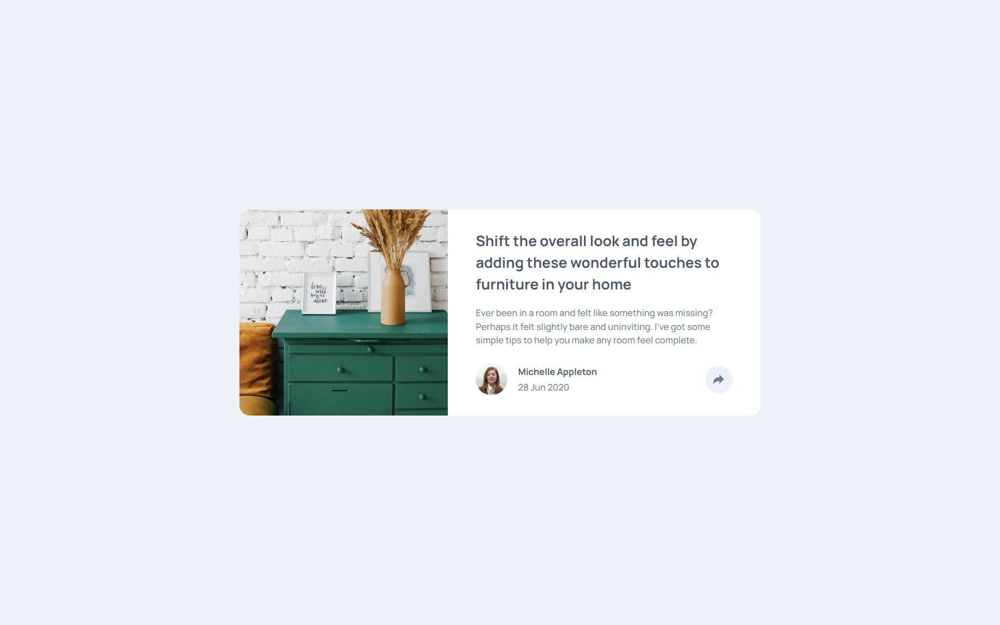

#  Frontend Mentor - Article Preview Component Solution

This is a solution to the [Article preview component challenge on Frontend Mentor](https://www.frontendmentor.io/challenges/article-preview-component-dYBN_pYFT). Frontend Mentor challenges help you improve your coding skills by building realistic projects.

## Table of contents

- [Overview](#overview)
  - [The challenge](#the-challenge)
  - [Screenshot](#screenshot)
  - [Links](#links)
- [My process](#my-process)
  - [Built with](#built-with)
  - [Useful resources](#useful-resources)
- [Author](#author)
- [Acknowledgments](#acknowledgments)

## Overview

### The challenge

Users should be able to:

- View the optimal layout for the component depending on their device's screen size
- See the social media share links when they click the share icon

### Screenshot

### Links

- [Solution](https://www.frontendmentor.io/solutions/responsive-article-preview-component-hrSakMvC2c)
- [Live Site](https://ecemgo-article-preview-component.netlify.app/)

## My process

### Built with

- Semantic HTML5 markup
- CSS custom properties
- Flexbox
- CSS Grid
- Vanilla Javascript

### Useful resources

- [CSS Tricks](https://css-tricks.com/almanac/properties/t/transform/) - It is used to visually manipulate an element.

## Author

- Frontend Mentor - [@ecemgo](https://www.frontendmentor.io/profile/ecemgo)
- Twitter - [@ecemgo](https://twitter.com/ecemgo)
- CodePen - [@ecemgo](https://codepen.io/ecemgo)
- YouTube - [@ecemgokdogan](https://www.youtube.com/channel/UCktkPv17cw27PaFGcnZa_aQ)
