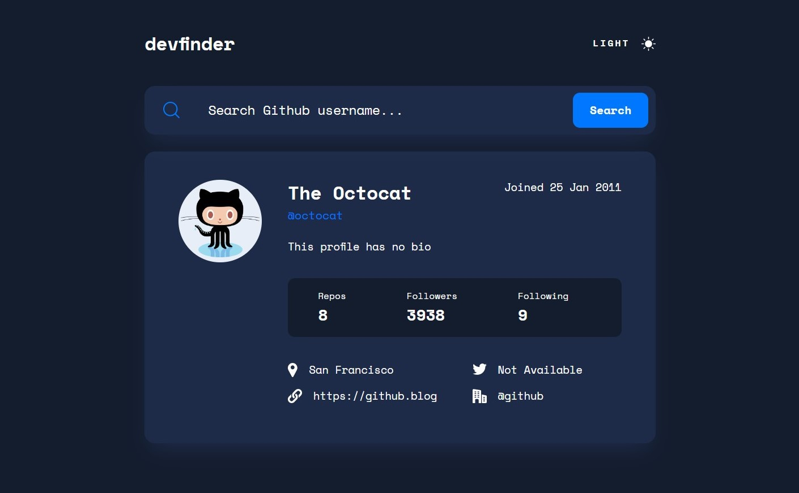
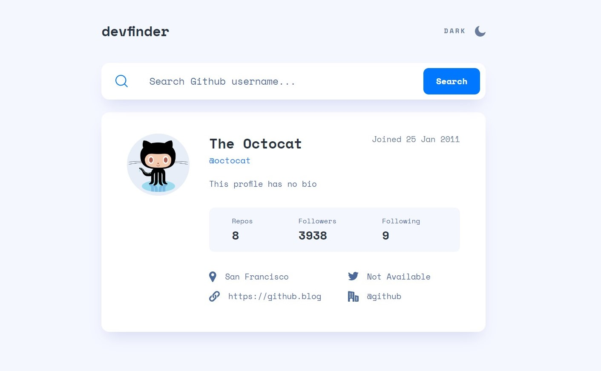

#  Frontend Mentor - GitHub User Search App Solution

This is a solution to the [GitHub user search app challenge on Frontend Mentor](https://www.frontendmentor.io/challenges/github-user-search-app-Q09YOgaH6). Frontend Mentor challenges help you improve your coding skills by building realistic projects.

## Table of contents

- [Overview](#overview)
  - [The challenge](#the-challenge)
  - [Screenshot](#screenshot)
  - [Links](#links)
- [My process](#my-process)
  - [Built with](#built-with)
  - [Useful resources](#useful-resources)
- [Author](#author)
- [Acknowledgments](#acknowledgments)

## Overview

### The challenge

Users should be able to:

- View the optimal layout for the app depending on their device's screen size
- See hover states for all interactive elements on the page
- Search for GitHub users by their username
- See relevant user information based on their search
- Switch between light and dark themes
- **Bonus**: Have the correct color scheme chosen for them based on their computer preferences. _Hint_: Research `prefers-color-scheme` in CSS.

### Screenshot

<h3>Dark mode</h3>

<h3>Light Mode</h3>

### Links

- [Solution](https://www.frontendmentor.io/solutions/responsive-github-user-search-app-via-pure-css-and-js-jDgRSvWcs9)
- [Live Site](https://ecemgo-github-user-search-app.netlify.app/)

## My process

### Built with

- Semantic HTML5 markup
- CSS custom properties
- Flexbox
- CSS Grid
- GitHub API
- Vanilla Javascript

### Useful resources

- [GitHub API](https://api.github.com/users/ecemgo) - It is used for understanding the GitHub API.
- [Github Search Users By Username](https://www.youtube.com/watch?v=7YeOjmpQUnU) - It is used for understanding the concept of Fetch API.
- [Preferred Theme with Local Storage](https://stackoverflow.com/questions/73617133/how-would-i-store-user-theme-preferences-across-multiple-pages) - It is used for understanding the concept of the preferred theme with local storage.
- [Typing Animation](https://www.youtube.com/watch?v=3qOTdDPt1Cc) - It is used for the placeholder with typing animation.
- [Regex](https://stackoverflow.com/questions/10625497/regex-to-check-if-http-or-https-exists-in-the-string) - Regex is used to check if `http` or `https` exists in the string.
- [CodeSandbox](https://codesandbox.io/s/github/UnTalPeluca/GitHubUserSearchApp/tree/main/?file=/style.css) - It is used for the reference.

## Author

- Website - [ecemgo.com](https://www.ecemgo.com/)
- Frontend Mentor - [@ecemgo](https://www.frontendmentor.io/profile/ecemgo)
- Twitter - [@ecemgo](https://twitter.com/ecemgo)
- CodePen - [@ecemgo](https://codepen.io/ecemgo)
