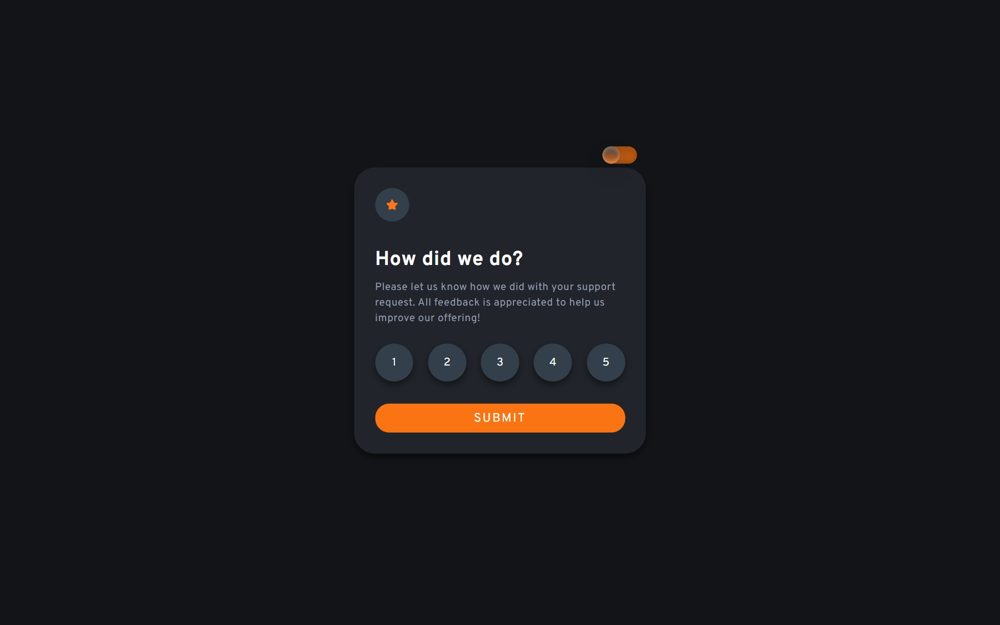

#  Frontend Mentor - Interactive Rating Component Solution

This is a solution to the [Interactive rating component challenge on Frontend Mentor](https://www.frontendmentor.io/challenges/interactive-rating-component-koxpeBUmI). Frontend Mentor challenges help you improve your coding skills by building realistic projects.

## Table of contents

- [Overview](#overview)
  - [The challenge](#the-challenge)
  - [Screenshot](#screenshot)
  - [Links](#links)
- [My process](#my-process)
  - [Built with](#built-with)
  - [Useful resources](#useful-resources)
- [Author](#author)

## Overview

### The challenge

Users should be able to:

- View the optimal layout for the app depending on their device's screen size
- See hover states for all interactive elements on the page
- Select and submit a number rating
- See the "Thank you" card state after submitting a rating

### Screenshot

<h3>Dark mode</h3>

<h3>Colorful Mode</h3>

### Links

- [Solution](https://www.frontendmentor.io/solutions/interactive-rating-component-with-the-darkcolorful-theme-BtpOqZVC5B)
- [Live Site](https://ecemgo-interactive-rating-component.netlify.app/)

## My process

### Built with

- Semantic HTML5 markup
- CSS custom properties
- Flexbox
- Javascript

### Useful resources

- [Pixelied](https://pixelied.com/features/svg-editor) - It is a free SVG editor tool and the color of svg files have been set with it.
- [Color Space](https://mycolor.space/) - It is used to set the color palette.
- [Blog LogRocket](https://blog.logrocket.com/three-ways-style-css-box-shadow-effects/) - It is a document about box shadow.

## Author

- Frontend Mentor - [@ecemgo](https://www.frontendmentor.io/profile/ecemgo)
- Twitter - [@ecemgo](https://twitter.com/ecemgo)
- CodePen - [@ecemgo](https://codepen.io/ecemgo)
- YouTube - [@ecemgokdogan](https://www.youtube.com/channel/UCktkPv17cw27PaFGcnZa_aQ)
