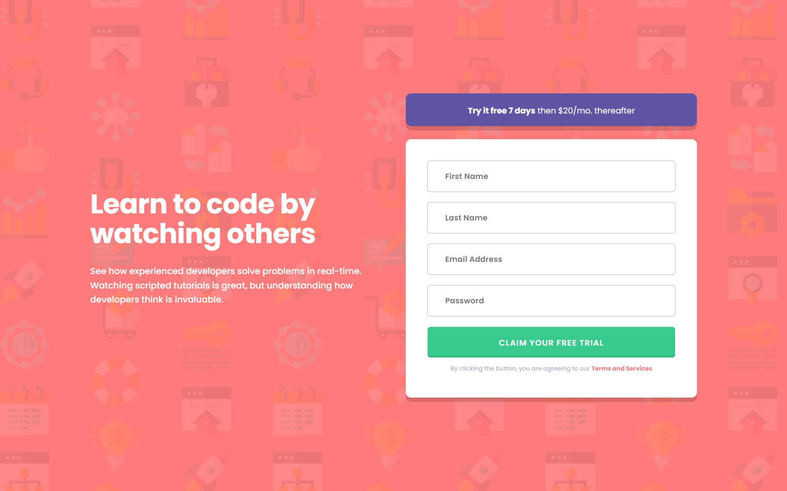

#  Frontend Mentor - Intro Component with Sign-up Form Solution

This is a solution to the [Intro component with sign up form challenge on Frontend Mentor](https://www.frontendmentor.io/challenges/intro-component-with-signup-form-5cf91bd49edda32581d28fd1). Frontend Mentor challenges help you improve your coding skills by building realistic projects.

## Table of contents

- [Overview](#overview)
  - [The challenge](#the-challenge)
  - [Screenshot](#screenshot)
  - [Links](#links)
- [My process](#my-process)
  - [Built with](#built-with)
  - [Useful resources](#useful-resources)
- [Author](#author)

## Overview

### The challenge

Users should be able to:

- View the optimal layout for the site depending on their device's screen size
- See hover states for all interactive elements on the page
- Receive an error message when the `form` is submitted if:
  - Any `input` field is empty. The message for this error should say _"[Field Name] cannot be empty"_
  - The email address is not formatted correctly (i.e. a correct email address should have this structure: `name@host.tld`). The message for this error should say _"Looks like this is not an email"_

### Screenshot

### Links

- [Solution URL](https://github.com/ecemgo/frontend-mentor-challenges/tree/main/intro-component-with-signup-form)
- [Live Site URL](https://ecemgo-intro-component-signup-form.netlify.app/)

## My process

### Built with

- Semantic HTML5 markup
- CSS custom properties
- CSS Grid
- CSS Animation
- Javascript

### Useful resources

- [Youtube](https://www.youtube.com/watch?v=4ALLynsZ0u0&ab_channel=KevinPowell) - Kevin Powell's channel helps how to create interesting blob shapes with CSS.
- [Fancy Border Radius](https://9elements.github.io/fancy-border-radius/) - It is a fancy border radius generator.
- [Youtube](https://www.youtube.com/watch?v=rsd4FNGTRBw) - Florin Pop's channel is the reference.

## Author

- Website - [ecemgo.com](https://www.ecemgo.com/)
- Frontend Mentor - [@ecemgo](https://www.frontendmentor.io/profile/ecemgo)
- Twitter - [@ecemgo](https://twitter.com/ecemgo)
- CodePen - [@ecemgo](https://codepen.io/ecemgo)
