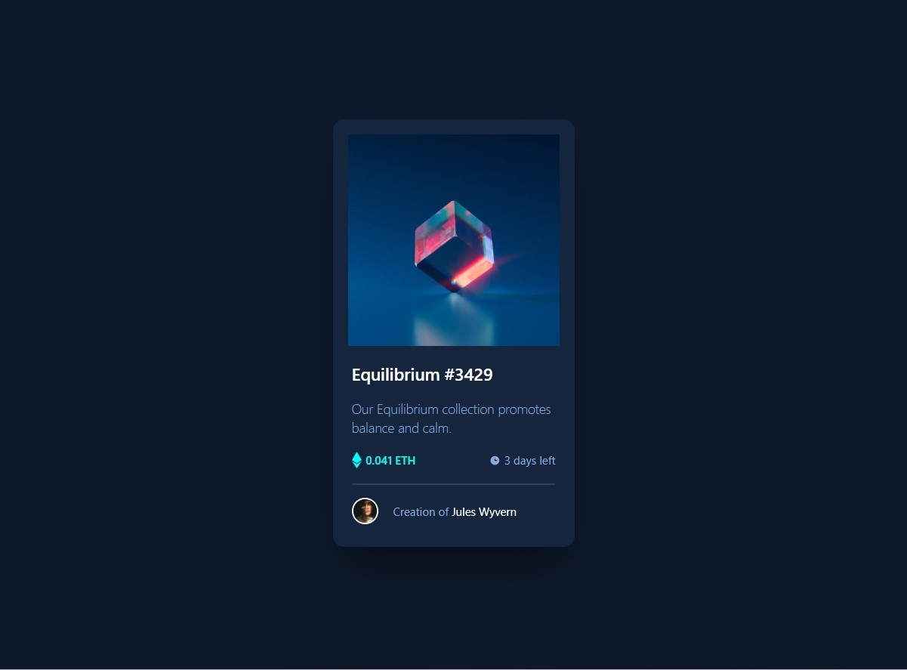

# Frontend Mentor - NFT preview card component solution

This is a solution to the [NFT preview card component challenge on Frontend Mentor](https://www.frontendmentor.io/challenges/nft-preview-card-component-SbdUL_w0U). Frontend Mentor challenges help you improve your coding skills by building realistic projects.

## Table of contents

- [Overview](#overview)
  - [Screenshot](#screenshot)
  - [Links](#links)
- [My process](#my-process)
  - [Built with](#built-with)
  - [What I learned](#what-i-learned)
  - [Useful resources](#useful-resources)
- [Author](#author)

## Overview

### The challenge

### Screenshot

### Links

- [Solution URL](https://github.com/ecemgo/frontend-mentor-challenges/tree/main/nft-preview-card-component)
- [Live Site URL](https://ecemgo-nft-preview-card.netlify.app/)

## My process

### Built with

- Semantic HTML5 markup
- CSS custom properties
- Tailwind CSS - Framework
- Flexbox

### What I learned

In this project, I focused on the following features of Tailwind CSS:

- How to make hover effect
- How to use transition duration
- Using shadows on colored backgrounds
- Using flexbox

### Useful resources

- [Tailwindcss Documentation](https://tailwindcss.com/docs/installation) - This helped me to understand the concept and apply the necessary features.
- [Hover effect on image](https://tailwind-elements.com/docs/standard/components/hover-effects/) - This helped me how to make the hover effect on the image called equilibrium.

## Author

- Website - [ecemgo.com](https://www.ecemgo.com/)
- Frontend Mentor - [@ecemgo](https://www.frontendmentor.io/profile/ecemgo)
- Twitter - [@ecemgo](https://twitter.com/ecemgo)
