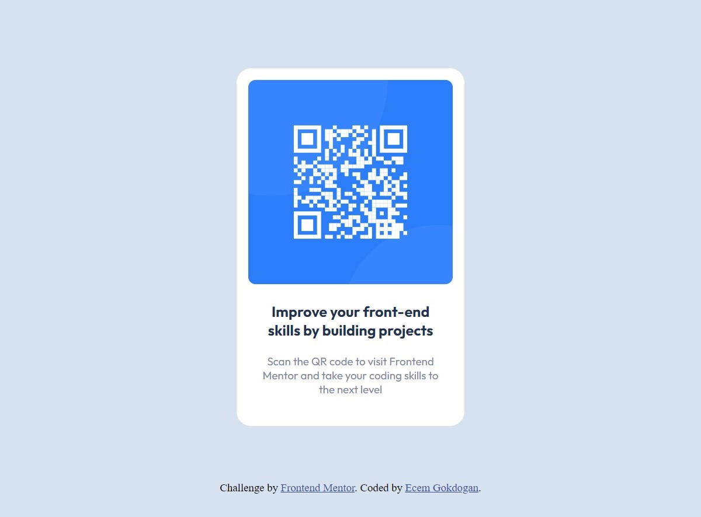

#  Frontend Mentor - QR Code Component Solution

This is a solution to the [QR code component challenge on Frontend Mentor](https://www.frontendmentor.io/challenges/qr-code-component-iux_sIO_H). Frontend Mentor challenges help you improve your coding skills by building realistic projects.

## Table of contents

- [Overview](#overview)
  - [Screenshot](#screenshot)
  - [Links](#links)
- [My process](#my-process)
  - [Built with](#built-with)
  - [What I learned](#what-i-learned)
- [Author](#author)

## Overview

### Screenshot



### Links

- [Solution URL](https://github.com/ecemgo/Frontend-Mentor-Challenges/tree/main/qr-code-component)
- [Live Site URL](https://ecemgo-qr-code-component.netlify.app/)

## My process

### Built with

- Semantic HTML5 markup
- Pure CSS
- Flexbox

### What I learned

In this project, pure CSS and flexbox were used. Flexbox is a one-dimensional layout system to make web design responsive, and it provides that the elements can change their behavior depending on the kind of device displaying them. Additionally, it makes elements flexible and provides them with appropriate position, and symmetry. Thus, responsive web pages are able to be designed and built without having to use a lot of float and position properties in the CSS.


- In this project, align-self is used to make the footer located at the end of the page in the html:

```html
<div class="attribution" style="align-self: flex-end"></div>
```

- In order to center the qr-code-box on the page, flexbox is used:

```css
.qr-code-box {
  display: flex;
  flex-direction: column;
  justify-content: center;
  align-items: center;
  min-height: 100vh;
}
```

- In order to make the card responsive, `max-width` is used

```css
.qr-code-box {
  max-width: 20rem;

```

- In order to make the card responsive and the image positioned completely on the card:

```css
.qrimg {
  width: 100%;
  display: block;
}
```

## Author

- Website - [ecemgo.com](https://www.ecemgo.com/)
- Frontend Mentor - [@ecemgo](https://www.frontendmentor.io/profile/ecemgo)
- Twitter - [@ecemgo](https://twitter.com/ecemgo)
