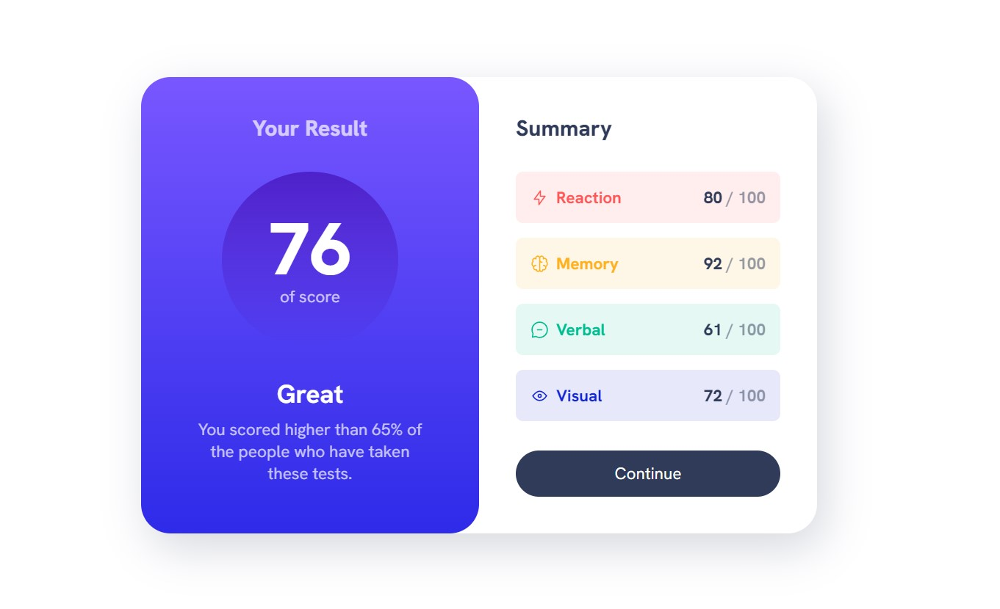

#  Frontend Mentor - Results Summary Component Solution

This is a solution to the [Results summary component challenge on Frontend Mentor](https://www.frontendmentor.io/challenges/results-summary-component-CE_K6s0maV). Frontend Mentor challenges help you improve your coding skills by building realistic projects.

## Table of contents

- [Overview](#overview)
  - [The challenge](#the-challenge)
  - [Screenshot](#screenshot)
  - [Links](#links)
- [My process](#my-process)
  - [Built with](#built-with)
  - [Useful resources](#useful-resources)
- [Author](#author)

## Overview

### The challenge

Users should be able to:

- View the optimal layout for the interface depending on their device's screen size
- See hover and focus states for all interactive elements on the page

### Screenshot

### Links

- [Solution URL](https://github.com/ecemgo/frontend-mentor-challenges/tree/main/results-summary-component)
- [Live Site URL](https://ecemgo-result-summary-component.netlify.app/)

## My process

### Built with

- Semantic HTML5 markup
- CSS custom properties
- Flexbox
- CSS Grid
- ScrollReveal JS

### Useful resources

- [ScrollReveal](https://scrollrevealjs.org/) - It is a source for animation and it's been used for installation.
- [ScrollReveal Effect](https://www.youtube.com/watch?v=Zwa5z9Ws7y4) - It's been used for how to apply ScrollReveal JS.
- [Kevin Powell](https://www.youtube.com/@KevinPowell) - Kevin Powell's Youtube Channel is a useful source to learn the CSS concept.

## Author

- Website - [ecemgo.com](https://www.ecemgo.com/)
- Frontend Mentor - [@ecemgo](https://www.frontendmentor.io/profile/ecemgo)
- Twitter - [@ecemgo](https://twitter.com/ecemgo)
