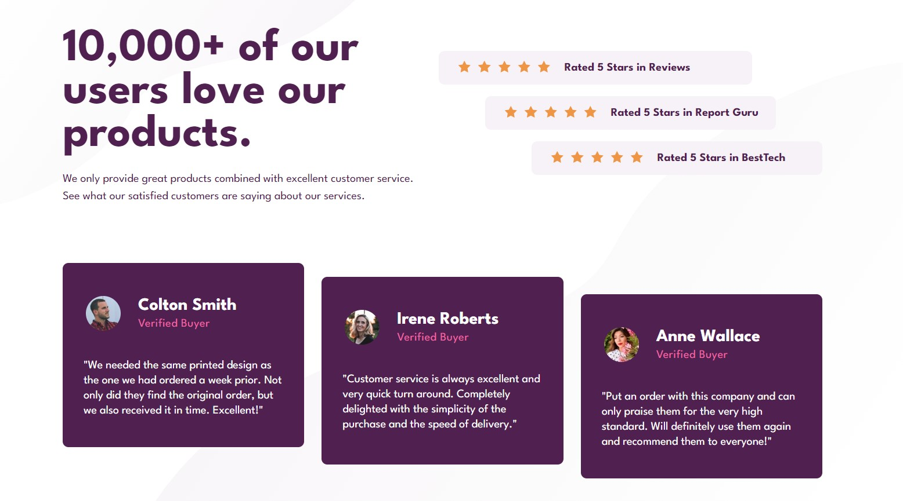

#  Frontend Mentor - Social Proof Section Solution

This is a solution to the [Social proof section challenge on Frontend Mentor](https://www.frontendmentor.io/challenges/social-proof-section-6e0qTv_bA). Frontend Mentor challenges help you improve your coding skills by building realistic projects.

## Table of contents

- [Overview](#overview)
  - [The challenge](#the-challenge)
  - [Screenshot](#screenshot)
  - [Links](#links)
- [My process](#my-process)
  - [Built with](#built-with)
  - [Useful resources](#useful-resources)
- [Author](#author)

## Overview

### The challenge

Users should be able to:

- View the optimal layout for the section depending on their device's screen size

### Screenshot

### Links

- [Solution](https://www.frontendmentor.io/solutions/responsive-social-proof-section-using-css-grid-SrMTOkGviU)
- [Live Site](https://ecemgo-social-proof.netlify.app/)

## My process

### Built with

- Semantic HTML5 markup
- CSS custom properties
- Flexbox
- CSS Grid

### Useful resources

- [Youtube](https://www.youtube.com/watch?v=EiNiSFIPIQE&list=PLu1KCubHpvAri_OLXFM8Sb1rf1gQVMYDJ&index=4&t=477s) - Slaying The Dragon's channel is used to understand the concept of CSS Grid.
- [Wes Bos](https://cssgrid.io/) - It is used to understand the concept of CSS Grid.

## Author

- Website - [ecemgo.com](https://www.ecemgo.com/)
- Frontend Mentor - [@ecemgo](https://www.frontendmentor.io/profile/ecemgo)
- Twitter - [@ecemgo](https://twitter.com/ecemgo)
- CodePen - [@ecemgo](https://codepen.io/ecemgo)
